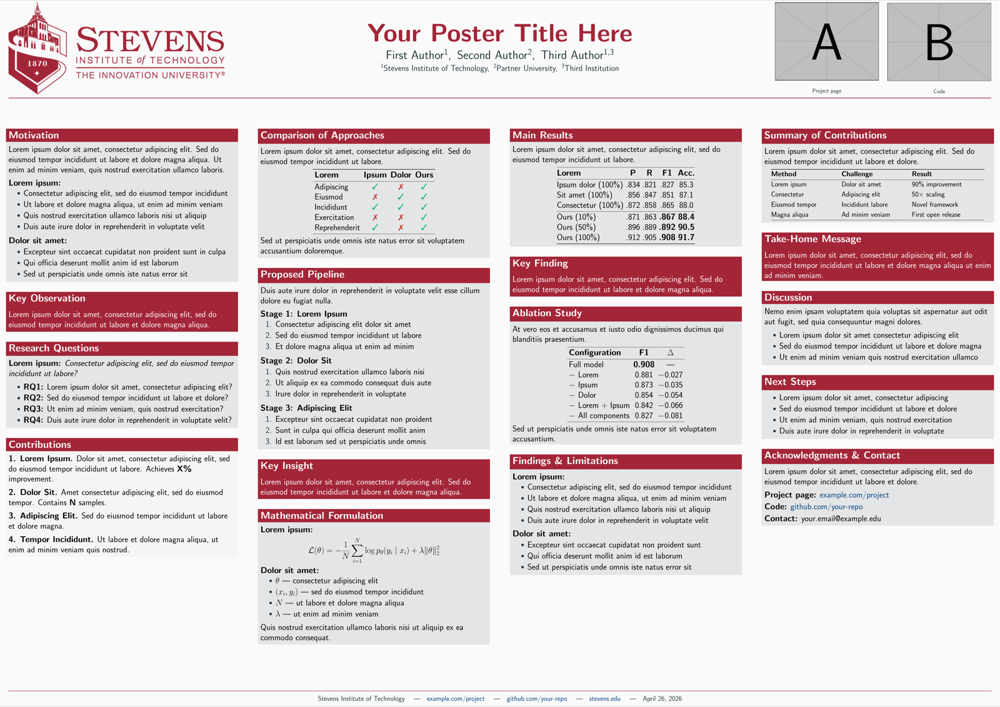

# Stevens Institute of Technology Beamer Poster Template

[](https://www.latex-project.org/)
[](#)
[](https://www.stevens.edu/)
[](LICENSE)

A clean, professional **A0 conference poster template** in official **Stevens Institute of Technology** branding. Built on `beamerposter` with the [Moloch](https://github.com/jolists/moloch) theme, Stevens red color scheme, custom block environments, a **figure-centric 3-column layout** with a hero diagram in the visual center, a warm-cream **takeaway** call-out for results, and a one-line orientation toggle.

<p align="center">
  
</p>

<p align="center"><sub>Default A0 landscape compile -- four-column adaptive flow, Stevens-branded header, QR / image corner, and footer URL strip.</sub></p>

---

## You only edit two things

> 1. **Content in `sections/*.tex`** -- one block per file, mapped to a fixed slot in the layout.
> 2. **The metadata block at the top of `main.tex`** -- title, authors, institutes, project / code URLs.
> 3. **The hero figure in `figures/`** -- swap the default `example-image` placeholder for your own `\includegraphics{...}` call inside `\posterbody`.

Everything else -- column widths, block placement, header banner, footer rule, takeaway call-out style, QR-code corner, orientation geometry -- is handled by the template.

## What's automatic

| Concern                                | How it's handled                                                                                                |
|----------------------------------------|-----------------------------------------------------------------------------------------------------------------|
| **Figure-centric 3-column layout**     | Left narrow (0.235w) for intro / method, center wide (0.510w) with a hero diagram on top + 2 text sub-columns below, right narrow (0.235w) for results + take-home. |
| **Hero diagram placement**             | Sits at the top of the center column, where the reader's eye lands first -- not buried in a results column.    |
| **Takeaway call-out**                  | A `\begin{takeawaybox}` environment renders a cream body with a red left rule and a bold "Takeaway." prefix. Drop it inside any result block. |
| **Block atomicity**                    | Every `block` / `colorblock` / `contribblock` is wrapped in a minipage so the center column's inner `multicols` moves blocks whole instead of slicing them mid-content. |
| **Orientation**                        | One switch (`\posterlandscapetrue` / commented-out for portrait) picks A0 landscape or portrait. The 3-column layout is tuned for landscape. |
| **Title centering**                    | Header is symmetric: logo on the left, title block in the middle, image corner on the right -- title always page-centered. |
| **Multi-institution authors**          | Beamer's `\inst{N}` superscripts; authors and institutes render on a single line each, comma-separated.        |
| **Footer divider at the bottom**       | Footer is in beamer's `footline` template, anchored to the bottom of every frame regardless of body height.    |
| **QR / image corner conditional**      | Two switches drive a 3-way layout: two images side-by-side, one centered, or empty (title still centered).     |
| **Footer URL strip**                   | Project URL, code URL, contact, and date pulled from the same metadata commands as the QR codes.               |

## Features

- **Out-of-the-box A0** -- portrait or landscape, switchable with a single line
- **Figure-centric 3-column body** -- narrow / wide-with-figure-on-top + 2 sub-cols / narrow; reading order flows column-by-column
- **Stevens-branded color scheme** -- Stevens red (#A32638) on block titles, accent rules, and links
- **Moloch-inspired styling** -- minimal, information-dense blocks
- **Full-width header banner** with Stevens long logo, title (set in `\veryHuge` with tightened line spread), multi-affiliation authors, and a 2-image corner (QR codes / photos / placeholders)
- **Four custom block-like environments** -- `block`, `colorblock`, `contribblock`, and the `takeawaybox` call-out -- on top of beamer's `alertblock` and `exampleblock`
- **Algorithm / listings ready** -- `algorithm` + `algpseudocode` + `listings` (with line numbers) preconfigured
- **Renameable system macro** -- `\system` and `\proj{...}` defined in the preamble; change the system name in one place
- **Check / cross marks** -- `\cmark` and `\xmark` for comparison tables
- **Stevens red footer rule** with project URL, code URL, contact, and date

## Quick Start

```bash
git clone https://github.com/guanqun-yang/StevensTechBeamerPosterTemplate.git
cd StevensTechBeamerPosterTemplate
pdflatex main.tex
pdflatex main.tex   # twice so multicol balances columns
```

Open `main.tex`, edit the metadata block at the top (title, authors, institutes, URLs), drop your hero figure into `figures/` and swap the `example-image` filename inside `\posterbody`, then edit the seven section files in `sections/`. That's it. Or use any LaTeX editor (Overleaf, Texifier, VSCode + Tectonic).

## Orientation

```latex
\newif\ifposterlandscape
\posterlandscapetrue   % comment out this line for portrait
```

| Mode      | Page size        | Layout                                                |
|-----------|------------------|-------------------------------------------------------|
| Landscape | A0 (1189x841 mm) | 3 columns: narrow / wide-with-figure + 2 sub / narrow |
| Portrait  | A0 (841x1189 mm) | Same 3-column structure, proportionally narrower      |

The body layout is tuned for landscape; portrait still compiles but you may need to shorten section content so the narrower side columns don't overflow.

## Project Structure

```
.
├── main.tex                    # Entry point -- preamble, header, body, footer
├── sections/                   # One file per layout slot, in reading order
│   ├── 001-motivation.tex      # LEFT col, top: motivation + comparison table
│   ├── 002-design.tex          # LEFT col, mid: approach / components
│   ├── 003-example.tex         # LEFT col, bottom: concrete example
│   ├── 004-algorithm.tex       # CENTER col, left sub: algorithm pseudocode
│   ├── 005-setup.tex           # CENTER col, right sub: dataset + contributions
│   ├── 006-results.tex         # RIGHT col, top: result blocks + takeawayboxes
│   └── 007-takehome.tex        # RIGHT col, bottom: take-home contribblock
├── figures/                    # Project images -- hero diagram goes here
├── assets/
│   ├── stevens-long-logo.png   # Stevens logo (header banner, left)
│   ├── logo_RGB.png            # Alt Stevens logo
│   ├── beamerthememoloch.sty   # Moloch theme files
│   ├── beamerthemesintef.sty   # SINTEF base theme
│   ├── sintefcolor.sty         # Color definitions
│   └── ...                     # Other Beamer theme .sty files
└── README.md
```

`assets/` holds theme / branding files (logos, `.sty`); `figures/` holds project-specific images you'd swap per poster (the hero diagram, plots, author photos). Both are on `\graphicspath`, so `\includegraphics{my-diagram}` resolves wherever the file lives.

### Layout map

```
+---------------+-------------------------------+---------------+
| 001 motivation|        HERO DIAGRAM           | 006 results   |
|               |    (figures/your-diagram)     |  (with        |
| 002 design    |                               |   takeaway-   |
|               +---------------+---------------+   boxes)      |
| 003 example   | 004 algorithm | 005 setup     |               |
|               |               |               | 007 takehome  |
+---------------+---------------+---------------+---------------+
```

## Customization

Most posters never need anything below this line -- defaults are sensible. Skim if you want to tweak.

### Adding / removing a section

The layout has seven fixed slots (left top/mid/bottom, center sub-left, center sub-right, right top, right bottom). To **add** a block to an existing slot, append it to the corresponding section file. To **change which slot** a section feeds, edit `\posterbody` in `main.tex` -- it's a small `columns` + `multicols{2}` skeleton, easy to reorder. There is no automatic re-flow across slots: that's the trade-off for the figure-centric layout.

### Block environments

- `\begin{block}{Title} ... \end{block}` -- Stevens-red header on light-gray body
- `\begin{colorblock}[text color]{bg color}{Title} ... \end{colorblock}` -- arbitrary fg / bg
- `\begin{contribblock}{Title} ... \end{contribblock}` -- red header on near-white body
- `\begin{takeawaybox} ... \end{takeawaybox}` -- cream body with a red left rule and a bold "Takeaway." prefix. Drop it inside a result block to anchor the reader's eye on the message instead of the table.
- Standard `alertblock` / `exampleblock` also work.

### Project / system macros

The preamble defines two macros so the system name lives in one place:

```latex
\newcommand{\system}{YourSystem\xspace}
\newcommand{\proj}[1]{\textsf{#1}}
```

Use `\system` for the system name and `\proj{task-name}` for project / task names rendered in a sans-serif font. Renaming the system is a one-line change.

### Multi-institution author lists

Beamer's `\inst{N}` superscript convention; literal `,\enspace` separators keep authors and institutes each on a single line:

```latex
\author{%
  First Author\inst{1},\enspace
  Second Author\inst{2},\enspace
  Third Author\inst{1,3}%
}
\institute{%
  \inst{1}Stevens Institute of Technology,\enspace
  \inst{2}Partner University,\enspace
  \inst{3}Third Institution%
}
```

- Use `\inst{1,3}` for an author affiliated with multiple institutions.
- For a **single-institution** poster, drop all `\inst{...}` markers.

### Right-corner images (top-right)

Two images sit in the top-right of the header. The shipped template uses `example-image-a` / `example-image-b` from the `mwe` package as placeholders so the layout is visible immediately. Configure URLs and toggles near the metadata block:

```latex
\newcommand{\projecturl}{https://example.com/project}
\newcommand{\projectlabel}{example.com/project}
\newcommand{\codeurl}{https://github.com/your-repo}
\newcommand{\codelabel}{github.com/your-repo}

\newif\ifshowprojectqr  \showprojectqrtrue  % comment out to hide project image
\newif\ifshowcodeqr     \showcodeqrtrue     % comment out to hide code image
```

`*url` strings feed both the QR-code encoding (when you swap to QR codes) and the clickable footer hyperlinks; `*label` strings are the footer's human-readable link text.

**Conditional layout** (handled automatically):

| Switches            | Render                                              |
|---------------------|-----------------------------------------------------|
| both true           | two images side-by-side, each fills its half-slot   |
| exactly one true    | one image centered, ~0.85 of corner width           |
| both false          | corner is empty (title stays centered on page)      |

**Swap to real QR codes.** Add `\usepackage{qrcode}` and replace each `\includegraphics{example-image-*}` inside `\posterrightcorner` with `\qrcode[height=10cm]{\projecturl}` (or `\codeurl`).

**Swap to author photos.** Drop headshots into `figures/` (e.g. `figures/photo-author1.png`) and replace the `example-image-*` filenames with your photo filenames.

### Colors

All Stevens colors are defined in `main.tex` and can be overridden. The primary accent is `stevensred` (RGB 163, 38, 56).

### Header banner

Customize logo placement, font sizes, or banner height by editing the `\posterheader` macro in `main.tex`.

## Requirements

- A LaTeX distribution with Beamer + `beamerposter` + `multicol` + `etoolbox` + `tcolorbox` + `algorithm` + `algpseudocode` + `listings` + `xspace` + `mwe` (TeX Live, MiKTeX, or MacTeX -- all standard packages, nothing exotic). Add `qrcode` if you swap the right-corner placeholders for real QR codes.
- No external installation needed beyond the standard distribution; theme `.sty` files are bundled in `assets/`.

## Troubleshooting

- **Center sub-columns look uneven.** Run `pdflatex` twice -- the inner `multicols{2}` needs the second pass to balance.
- **A block overflows past a column.** That single block is taller than one column; split it into two blocks, or move it to a wider slot in `\posterbody`. (You'll see a visible vertical overshoot, not a silent error.)
- **Title looks off-center.** The right-corner minipage is hidden but kept at width 0.22 to balance the left logo. Don't delete the minipage; toggle the QR switches off instead.
- **The hero figure is too tall and pushes the center sub-columns off the page.** Shrink it: change `\includegraphics[width=\linewidth]{...}` inside `\posterbody` to `\includegraphics[width=0.9\linewidth]{...}` or cap the height with `[height=0.35\textheight,keepaspectratio]`.

## Contributing

Contributions are welcome -- bug fixes, additional block styles, alternate layouts. Open an issue or pull request.

## License

[MIT License](LICENSE). The Stevens Institute of Technology logo and branding are the property of Stevens Institute of Technology.
